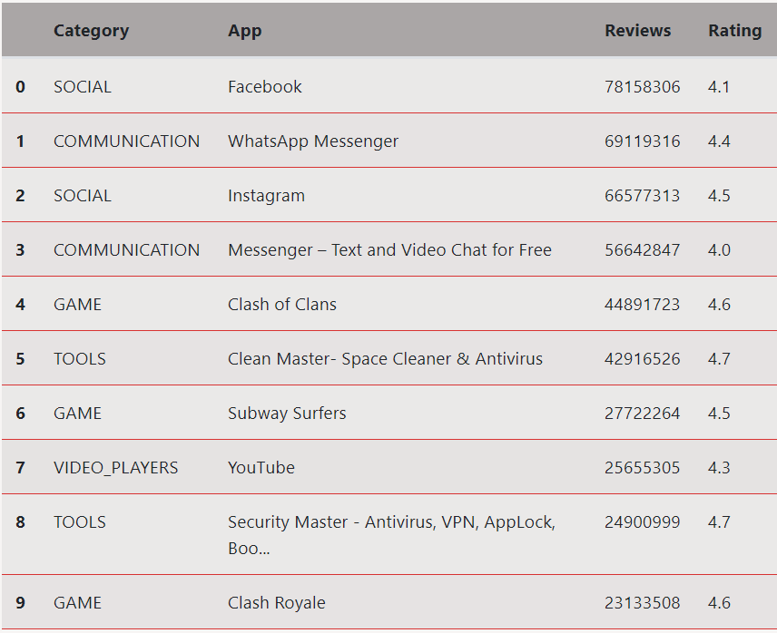

# Google Play Store Analytics

## Introduction
Projek ini dikembangkan sebagai salah satu capstone project dari Algoritma Academy Data Analytics Specialization. Deliverables yang diharapkan adalah Anda dapat membangun sebuah aplikasi web sederhana (dashboard) menggunakan framework Flask. Capstone ini akan fokus pada tampilan user interface Flask. 

## Data Summary
Data yang digunakan pada capstone project ini adalah data hasil scraping dari Google Playstore App. Data Google Playstore App terdiri dari beberapa variabe dengan rincian sebagai berikut:
- `App` : Nama aplikasi                
- `Category` : Kategori aplikasi
- `Rating` : Rating keseluruhan yang diberikan oleh user aplikasi(ketika di scrap)
- `Reviews` : Jumlah review yang diberikan oleh user aplikasi(ketika di scrap)
- `Size` : Ukuran aplikasi(ketika di scrap)           
- `Installs` : Jumlah user yang menginstall/mendownload aplikasi(Ketika di scrap)     
- `Type` : Tipe aplikasi (berbayar/gratis)       
- `Price` : Harga aplikasi (ketika di scrap)        
- `Content Rating` : Kelompok usia aplikasi ini ditargetkan - Children / Mature 21+ / Adult   
- `Genres` : Genre aplikasi.        
- `Last Updated` : Tanggal kapan aplikasi terakhir diperbarui di Play Store (ketika discrap) 
- `Current Ver` : Versi aplikasi saat ini tersedia di Play Store (ketika discrap)   
- `Android Ver` : Minimum versi Android yang diperlukan (ketika discrap) 

## Dependencies
- Flask
- Matplotlib
- Pandas
- Numpy

Semua modul tersebut dapat Anda install dengan cara :
```
pip install -r requirements.txt
```

## Rubrics
Pada capstone ini, saya membangun sebuah aplikasi Flask yang fokus pada tampilan user interface.  File pada repositori ini merupakan sebuah skeleton untuk membuat sebuah dashboard aplikasi Flask. Berikut beberapa langkah yang dilakukan:

### 1. Setting Repository Github dan Environment
- Repository 

a. Membuat repository baru di Github

b. Clone repository tersebut ke local dengan git clone
- Environment 

a. Created virtual environment called "flask_ui"

b. Install packages: pandas, flask, matplotlib, dan numpy

### 2. Data Preproses and Exploratory Data Analysis 
Pada tahap praproses ini, dilakukan praproses data seperti menghapus data yang duplikat, mengubah tipe data dan memodifikasi nilai data. 

### 3. Data Wrangling
- Pada tahap ini dilakukan grouping dan agregasi data. Data wrangling digunakan untuk menyiapkan data yang tepat sesuai analisis yang diminta. Pada capstone ini terdapat objek dictionary dengan nama `stats` dan melengkapi bagian yang rumpang agar menghasilkan data/nilai yang sesuai. Sebagai gambaran pada objek `stats` terdapat variabel `rev_tablel` dimana dilakukan grouping dan agregasi data yang digunakan untuk membuat data table seperti di bawah ini:


### 4. Data Visualization
- Membuat atau menduplikasi bar plot yang menggambarkan top 5 Category pada Google Playstore
- Membuat atau menduplikasi scatter plot yang menggambarkan sebaran aplikasi jika dilihat berdasarkan Review, Rating, dan jumlah aplikasi yang terinstall.
- Membuat atau menduplikasi histogram plot untuk melihat distribusi ukuran aplikasi 
- Membuat 1 plot tambahan bebas yang dapat merepresentasikan insight di dalam data

### 5. Build Flask App 
Mengacu pada poin ke empat Data Visualization di atas, selain membuat plot baru disini saya mendemonstrasikan bagaimana cara merender plot tersebut pada aplikasi Flask dan menampilkannya pada templates / halaman html.
dan pada `templates/index.html` Anda perlu memanggil source plot.png tempat Anda menyimpan gambar plot tersebut.
